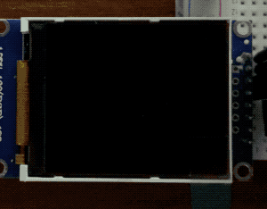

<p align="center">

</p>

## **+ Deprecation Notice**
[Read more...](https://github.com/juj/fbcp-ili9341)

## **+ Intro**

This repository contains customized copy of original [fbcp-ili9341](https://github.com/juj/fbcp-ili9341) repository by [Jukka Jylänki](https://github.com/juj). You can learn more about licensing in original [README.md](doc/README.md).

This version has a few new features and some changes. It also may not be fully tested on all device configurations, so keep this in mind when choosing this code over the official version.

~Good luck

## **+ Drivers**

The followinng displays are supported (see: [config.h](src/config.h)):

<table width="100%" cellpadding="0px" cellspacing="0px" style="width:100%;border:none;text-align:left;margin:0px;padding:0px;">
    <tbody><tr><td width="33.3%" style="padding:0px;">
        <ul style="padding:0px;line-height:20px">
        <li>ILI9488</li>
        <li>ILI9341</li>
        <li>ILI9340</li>
        <li>ILI9486L</li>
        <li>ILI9486</li>
        <li>HX8357D</li>
        <li>ST7789VW</li>
        <li>ST7789</li>
        </ul>
    </td><td width="33.3%" style="padding:0px;">
        <ul style="padding:0px;line-height:20px">
        <li>ST7735S</li>
        <li>ST7735R</li>
        <li>SSD1351</li>
        <li>MZ61581</li>
        <li>MPI3501</li>
        <li>KEDEI_V63_MPI3501</li>
        <li>WAVESHARE35B_ILI9486</li>
        <li>ADAFRUIT_ILI9341_PITFT</li>
        </ul>
    </td><td width="33.3%" style="padding:0px;">
        <ul style="padding:0px;line-height:20px">
        <li>FREEPLAYTECH_WAVESHARE32B</li>
        <li>WAVESHARE_ST7789VW_HAT</li>
        <li>PIRATE_AUDIO_ST7789_HAT</li>
        <li>WAVESHARE_ST7735S_HAT</li>
        <li>ADAFRUIT_HX8357D_PITFT</li>
        <li>TONTEC_MZ61581</li>
        </ul>
    </td></tr></tbody>
</table>

##  **+ Brief howto**

The installation is not fully automatic, you need to spend some time on going through the [config.h](src/config.h). Once it's done you could just copy the code onto your device, launch installer annd follow the instructions. It's pretty simple for those linux where it was tested.

Before the installation uncomment all the options that suitable for your setup in [config.h](src/config.h), leave commented what you don't need. Also have check [fbcpX.conf](build/fbcpX.conf) which is operational config that could be found in <code>/etc/fbcpx</code> diirectory.

### **++ Splash Screen**
<p align="center">

</p>

You also may wish to personalize splash screen. To do so you need to use [img2bin.sh](https://github.com/way5/image-converter-for-embedded#img2binsh) shell script. 

Just choose an image (jpg/png), copy it into <code>in</code> directory, run the script to check the options. Normally your command line would look like:

```bash
~$ ./img2bin.sh -r 100:100 -b 2 -bg 0000 myimage.jpg
```

### **++ Installation**

You may chouse to use eather:

```bash
~$ ./install.sh 
```

or manual method, using:

```bash
~$ cmake -S ./src -B ./build
~$ make -C ./build
```

### **++ Usage**

#### Signals:

| **Signal** | Description |
|:---:|:---|
| **SIGUSR1** | toggle backlight (if backlight control enabled) |
| **SIGUSR2** | switch on/off display (if display driver can do that) |
| **SIGPROF** | manually clear screen |

#### BlankTime:

Once display is in sleep mode if set <code>turn_off_after</code> and <code>ignore_redraw_area</code> it can be turned active again by using SIGUSR2.

If you are using fbcpX as a service:

```bash
~$ systemctl kill --signal=SIGUSR2 fbcpX
```

If it's a proccess:

```bash
~$ pkill --signal SIGUSR2 fbcpx
```

#### [fbcpX.conf](./build/fbcpX.conf)

In previous versions you'd need to compile the code defining configuration throgh command line. Now we can avoid this by using <code>config.h</code> and <code>fbcpX.conf</code>. 


| <div style="text-align:center;"></div> | **Let me know in [issues](https://github.com/way5/fbcp-X/issues) :beetle: if you have any suggestion or found an error.** &nbsp; &nbsp; &nbsp; &nbsp; &nbsp; &nbsp; &nbsp; &nbsp; &nbsp; &nbsp; &nbsp; &nbsp; &nbsp; &nbsp; &nbsp; &nbsp; &nbsp; &nbsp; &nbsp; &nbsp; &nbsp; &nbsp; &nbsp; &nbsp; &nbsp; &nbsp; &nbsp; &nbsp; &nbsp; &nbsp; &nbsp; &nbsp; &nbsp; &nbsp; &nbsp; &nbsp; &nbsp; &nbsp; &nbsp; |
|:---:|:---|


[logo]: ./doc/img/logo.jpg